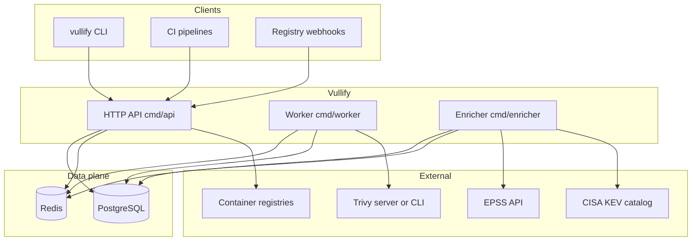

# Vullify

Vullify is a container image vulnerability management service. It connects to container registries (Docker Hub, GitLab, ECR, GCR, GHCR), syncs image metadata, queues vulnerability scans (Trivy), stores findings in PostgreSQL, and enriches CVEs with EPSS scores and CISA KEV data. A REST API exposes registries, images, scans, findings, and reports; optional webhooks trigger scans on push events.

## Architecture



- **API** serves `/healthz`, `/api/v1/*`, and `/webhooks/*`; it may run background schedulers for registry sync and rescans.
- **Worker** consumes scan jobs from Redis, runs Trivy against image references, and persists SBOMs and findings.
- **Enricher** listens for scan completion events on Redis, fetches EPSS and KEV data, and updates enrichment rows.

## Quick start (Docker Compose)

Prerequisites: [Docker](https://docs.docker.com/get-docker/) and Docker Compose.

```bash
docker compose up --build
```

Services:

| Service    | Port  | Role                          |
|------------|-------|-------------------------------|
| `api`      | 8080  | HTTP API                      |
| `worker`   | —     | Drains the Redis scan queue and runs **Trivy CLI** (moves scans from `pending` → completed) |
| `postgres` | 5432 | Application database          |
| `redis`    | 6379 | Scan queue and enricher events |
| `trivy`    | 4954 | Trivy server mode (optional; API env; worker uses the CLI in its image) |

Health check:

```bash
curl -s http://localhost:8080/healthz
```

The **API runs SQL migrations on startup** (`db.Migrate`) from `MIGRATIONS_DIR` (default `migrations` locally; the Docker image bundles them at `/migrations`). Point `DATABASE_URL` at Postgres before starting. For a one-off migrate without the API, use `golang-migrate` or any tool against the files in `migrations/`.

**Scan status `pending` is normal** until the **`worker`** process runs: `POST /api/v1/scans` only enqueues a job on Redis. The worker (`cmd/worker`, included as the `worker` service in Compose) picks up the job, runs Trivy, and updates the scan.

## API documentation

- **OpenAPI 3.0**: [`docs/openapi.yaml`](docs/openapi.yaml) — import into Postman, Swagger UI, or `redoc-cli`.
- **Summary**: JSON responses use `{ "data": ..., "meta": { "page", "per_page", "total" } }` for list endpoints. Errors use `{ "error": { "code", "message" } }`.

Main resource groups:

| Prefix | Purpose |
|--------|---------|
| `GET /healthz` | Liveness |
| `POST /webhooks/{dockerhub,github,gitlab}` | Registry push webhooks (authenticated per registry) |
| `/api/v1/registries` | CRUD + `POST .../sync` |
| `/api/v1/images` | List and detail images |
| `/api/v1/scans` | Create scan, get scan, list findings, raw SBOM |
| `GET /api/v1/findings/{id}` | Finding detail with enrichment |
| `GET /api/v1/dashboard/summary` | Aggregated counts |
| `GET /api/v1/reports/vulnerability` | Paginated vulnerability report |

## CLI usage

Build the CLI into `bin/` (Windows adds `.exe` automatically):

```bash
go build -o bin/vullify ./cmd/cli
```

Or `make build` to build `bin/vullify`, `bin/api`, and `bin/worker`.

Examples:

```bash
# Point at your API (default http://localhost:8080)
./bin/vullify --server https://vullify.example.com scan myregistry.io/ns/repo:1.0

# Fetch results for a scan
./bin/vullify results <scan_id>

# Download SBOM JSON for a completed scan
./bin/vullify sbom <scan_id>
```

Global flags: `--server`, optional `--token`, and `--timeout`. The CLI talks to the HTTP API only (not Postgres directly).

## CI/CD integration

**Trigger a scan after build** (example with `curl`):

```bash
curl -sS -X POST "$VULLIFY_URL/api/v1/scans" \
  -H "Content-Type: application/json" \
  -d "{\"image_ref\": \"$IMAGE_REF\"}"
```

**GitHub Actions** (illustrative job step):

```yaml
- name: Request vulnerability scan
  env:
    VULLIFY_URL: ${{ secrets.VULLIFY_URL }}
    IMAGE_REF: ${{ env.REGISTRY }}/${{ env.IMAGE_NAME }}:${{ github.sha }}
  run: |
    curl -fsS -X POST "$VULLIFY_URL/api/v1/scans" \
      -H "Content-Type: application/json" \
      -d "{\"image_ref\": \"$IMAGE_REF\"}"
```

**GitLab CI** uses the same `curl` pattern with `CI_REGISTRY_IMAGE` and `$CI_COMMIT_SHA` for tags.

For webhooks, configure registry credentials (including `webhook_secret`) in Vullify and point the registry’s webhook URL at `https://<your-host>/webhooks/dockerhub` (or `github` / `gitlab` as appropriate).

## Environment variables

| Variable | Description |
|----------|-------------|
| `HTTP_ADDR` | Listen address for the API (e.g. `:8080`). |
| `DATABASE_URL` | PostgreSQL connection string for `pgx`. |
| `MIGRATIONS_DIR` | Directory of `*.up.sql` files; API runs migrations on startup (default `migrations`; `/migrations` in the Docker image). |
| `REDIS_ADDR` | Redis address for `go-redis` (queue + pub/sub). |
| `TRIVY_SERVER` | Base URL of Trivy server mode (optional; worker may use CLI). |
| `TRIVY_PATH` | Path to `trivy` binary when not using server-only mode. |
| `TRIVY_VERSION` | Optional version string recorded with scans. |
| `SCAN_QUEUE_KEY` | Redis list key for pending scan jobs. |
| `SCAN_EVENTS_CHANNEL` | Redis channel for scan lifecycle events (enricher). |
| `WORKER_POOL_SIZE` | Concurrent workers processing the queue. |
| `JOB_MAX_RETRIES` | Max dequeue attempts before giving up on a job. |
| `KEV_REDIS_KEY` | Redis key for cached CISA KEV catalog (enricher). |
| `SCHEDULER_REGISTRY_SYNC_INTERVAL` | Interval for automatic registry sync (`0` disables). |
| `SCHEDULER_PERIODIC_RESCAN_INTERVAL` | Interval for periodic rescans. |
| `SCHEDULER_CHANGE_DETECTION_INTERVAL` | Interval for digest/tag change detection. |
| `SCHEDULER_STALE_SCAN_AGE` | Age after which images are considered stale for rescan. |

See [`.env.example`](.env.example) for a template.

## Development and tests

```bash
go build ./...
go test -short ./...          # skips Docker-based tests (testcontainers)
go test ./...                 # full suite (requires Docker for testcontainers)
go vet ./...
golangci-lint run             # or: go run github.com/golangci/golangci-lint/cmd/golangci-lint@v1.63.4 run ./...
```

Integration tests under `internal/integration` use PostgreSQL and Redis via testcontainers: they seed data, run the enricher against mocked EPSS/KEV HTTP servers, and assert dashboard and finding API responses. A full end-to-end path through the worker and real Trivy is best exercised with `docker compose` (API + worker + enricher + Redis + Postgres).

Run the full Go test suite on a machine with Docker available; CI should not use `-short` if you want testcontainers coverage.
